# Entra ID IAM Lab: Secure Identity Setup for "Default PVT LTD"

A hands-on Identity and Access Management (IAM) lab built in Microsoft Entra ID on a free tenant. I acted as the IAM admin for a small company and set up users, groups, least-privilege roles, guest access, an app registration. Everything is documented with screnshots.

**Author:** Utkarsh Singh | **Role focus:** Cloud Security Operations Analyst (Azure)
**Tools:** Microsoft Entra ID (free tier), Azure Portal

\---

## Scenario

Default PVT LTD is a small company that needs:

* Staff organized by department with access based on group membership
* Admin rights limited to what each person needs (least privilege)
* Safe handling of external contractors
* Baseline MFA and a way to trace every privilege change

\---

## What I built (live in the tenant)

|#|Area|What I did|Why|
|-|-|-|-|
|1|Users|Created 12 cloud users with job title and department filled in|Clean identity data makes group and access decisions easier|
|2|Groups|Created security groups (HR, Cyber Security, Developers, Data \& AI, Contractors) and added members|Access is assigned to groups, not individuals|
|3|Roles (RBAC)|Assigned **Helpdesk Administrator** to a support user instead of Global Admin|Least privilege: can reset passwords but cannot manage the directory|
|4|Break-glass accounts|Created 2 emergency cloud-only accounts with long passwords and Global Administrator|Recovery path if normal admin access is locked out|
|5|MFA|Verified **Security defaults** are enabled|Free baseline: MFA registration for all users, MFA for admins, legacy auth blocked|
|6|Guest access (B2B)|Invited an external user, who accepted and signed in to My Apps; added to Contractors group|Shows controlled external collaboration|
|7|Guest restrictions|Restricted guest permissions and who can invite guests|Limits exposure from external accounts|
|8|App registration|Registered `Default-Internal-App` (single tenant) with only default `User.Read`|Shows understanding of app identity and minimal permissions|
|9|Audit trail|Filtered Audit logs by `RoleManagement` and `UserManagement` to trace role assignments and the guest invite|Every privilege change is traceable|

\---

## Screenshots

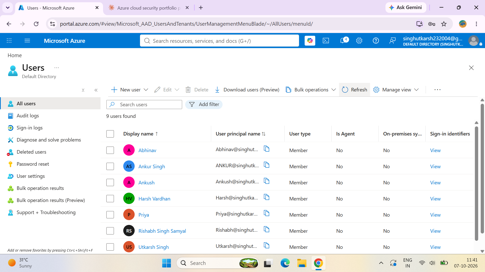
*Users created with job title and department.*

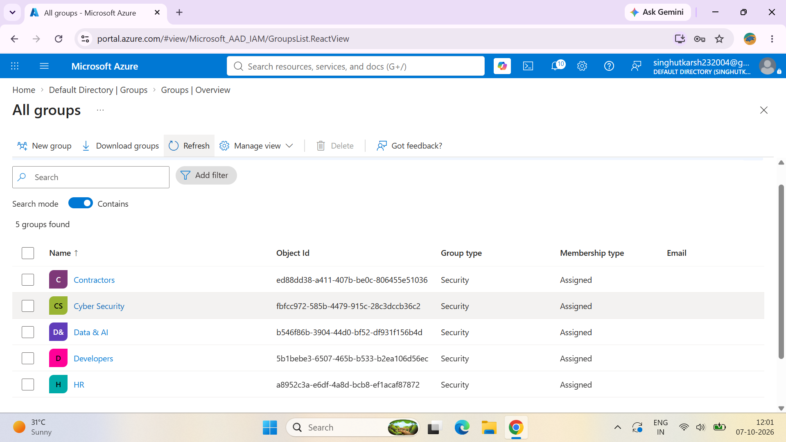
*Security groups for each department.*

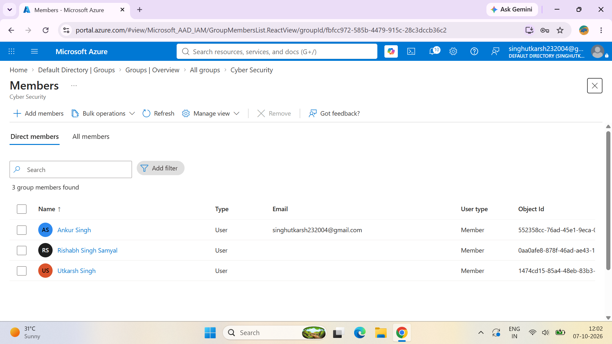
*Members added to a group. Access is assigned to groups, not individuals.*

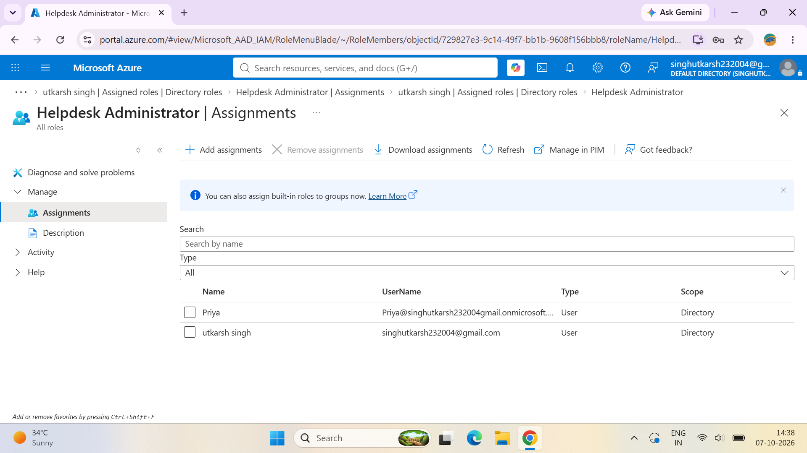
*Helpdesk Administrator assigned instead of Global Admin (least privilege).*

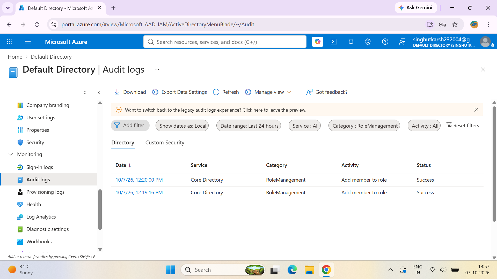
*Audit logs filtered to RoleManagement.*

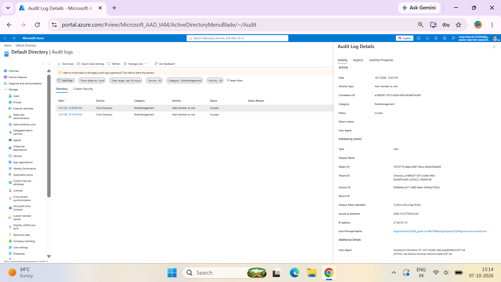
*Event details: who made the change and when.*

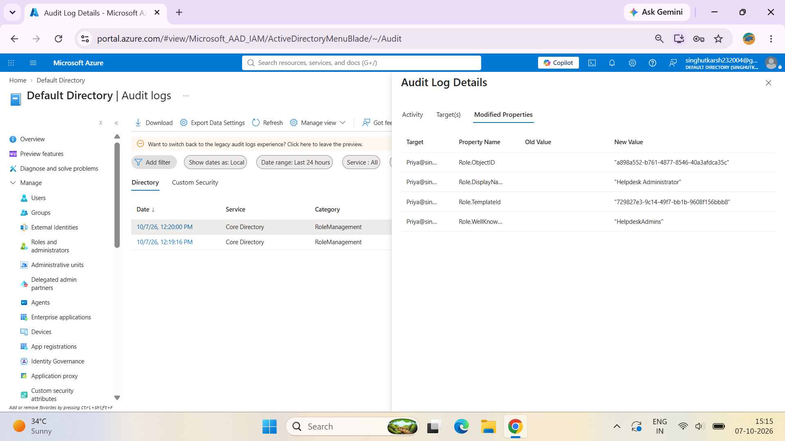
*Modified properties confirm which role was granted.*

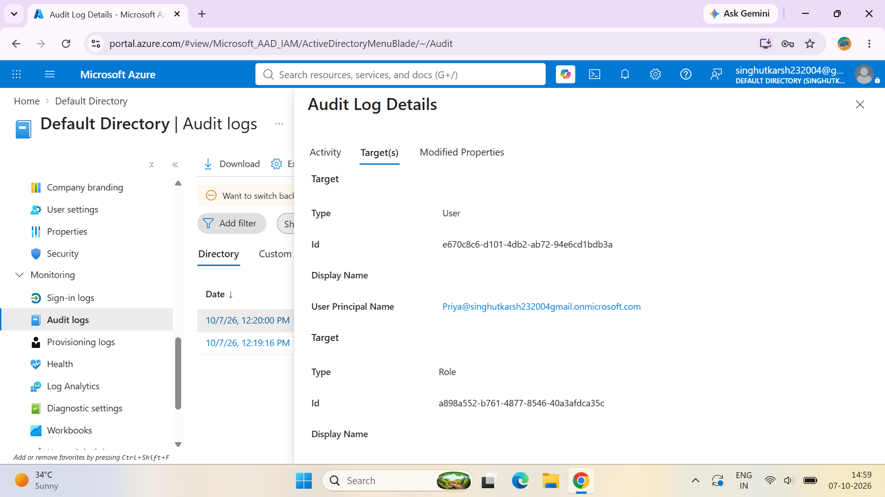
*Target of the change: the user who received the role.*

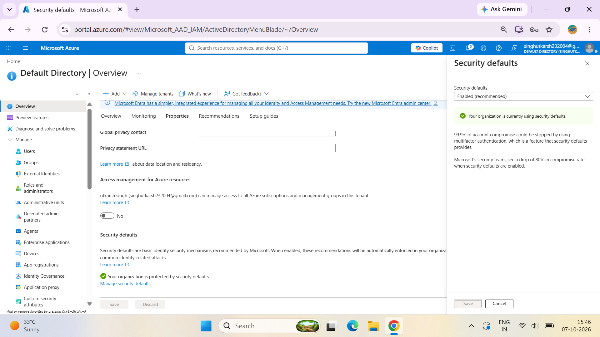
*Security defaults enabled for baseline MFA.*

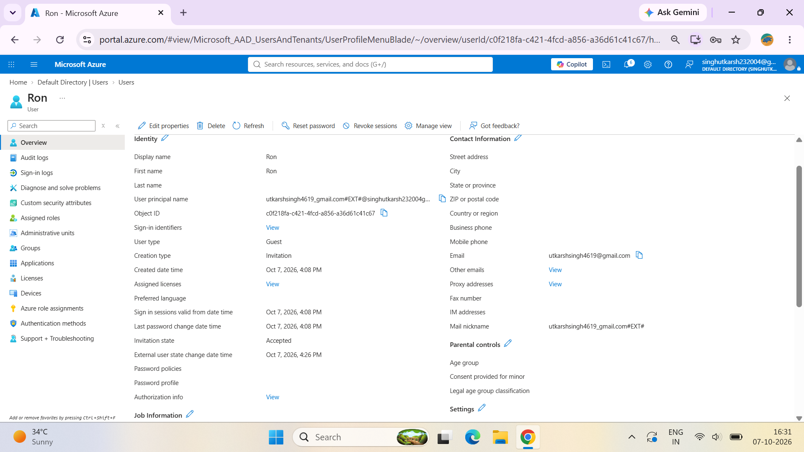
*External guest user, invitation state Accepted.*

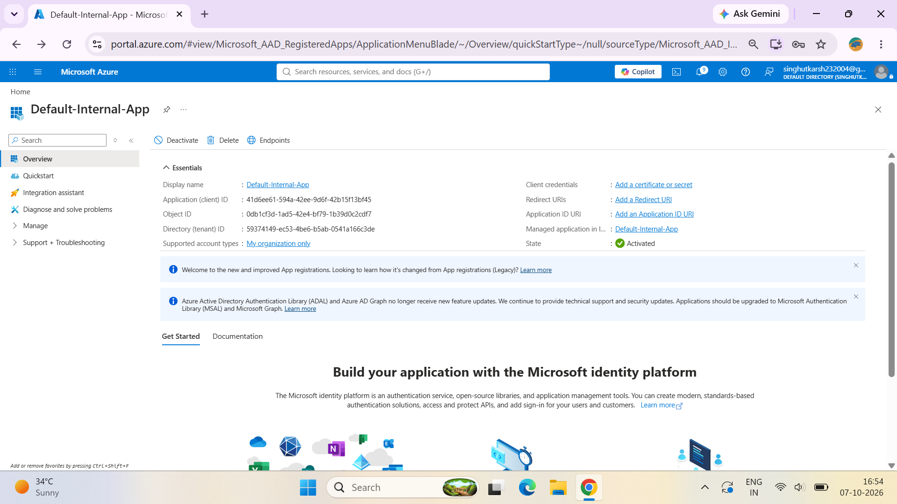
*App registration for Contoso-Internal-App.*

\---

## Policy design (not implemented, needs Entra ID P1/P2)

The free tenant does not include these features, so this section is a design only. I did **not** configure them.

* **Conditional Access:** require MFA for all users and admins; block legacy authentication; block sign-ins from unapproved countries. Deploy in **report-only mode first**, review the impact in sign-in logs, then enforce. Always exclude break-glass accounts.
* **Privileged Identity Management (PIM):** make admin roles *eligible* instead of permanent, with approval, justification, and a short activation window (for example 1 hour).
* **Access Reviews:** quarterly review of the Contractors group with a manager as reviewer.
* **Dynamic groups:** auto-assign users to groups by department attribute.
* **Identity Protection:** risk-based policies for risky sign-ins and users.

\---

## Key lessons

1. Group-based access scales better than per-user assignments.
2. Scoped roles such as Helpdesk Administrator reduce the number of Global Admins.
3. Break-glass accounts must exist and be excluded from restrictive policies, or a bad policy can lock everyone out.
4. Audit logs are the evidence trail for investigations: they show who did what, to whom, and when.
5. Free-tier limits are real. Knowing which controls need P1/P2 is part of the job.

## Next steps

* Enable Conditional Access and PIM with a P2 trial
* Send Entra logs to Microsoft Sentinel and turn the KQL queries into analytic rules
* Automate joiner/mover/leaver with Lifecycle Workflows

\---

## Security note

All data is from a personal lab tenant with fake users. Identifiers in screenshots are redacted.

